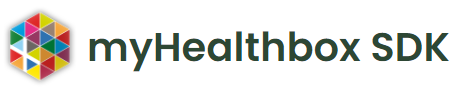

   

An SDK built on top of the <a href="https://rapidapi.com/roblat/api/myhealthbox/" target="_blank">myHealthbox API</a>, exposing methods for using and accessing the API.

## Disclaimer

This SDK is an unofficial open-source tool. It is not developed or backed by **myHealthbox**. The brand name and logo belong to **myHealthbox**.

## Description

**myHealthbox API v2.1** is distributed by <a href="https://rapidapi.com/roblat/api/myhealthbox/" target="_blank">RapidAPI</a>. It is an API that provides access to a huge database of medicines and healthcare products: over 3 million products available in 70 countries, with information accessible in 40 languages. It provides basic information for a product like name, active ingredients, dosage, ATC code and more. It also exposes documents, related to a product (i.e. Patient Information Leaflets, SmPC, etc.)

**myHealthbox SDK** is a user-friendly interface on top of **myHealthbox API**, that comes with a set of methods for easy access and configuration of the available endpoints. It is written entirely in `TypeScript` and packaged with its own types to improve the developer experience. It can be installed, configured and used in seconds.

## Getting started

To check out the <a href="https://flushbg.github.io/myhealthbox-sdk">docs</a>, visit https://flushbg.github.io/myhealthbox-sdk.
