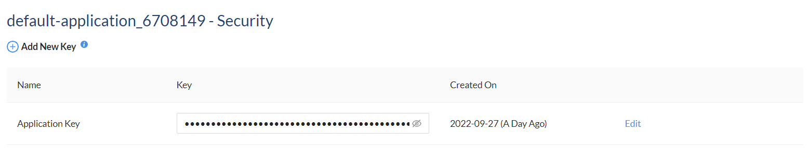

# Obtaining an API key

**myHealthbox API** is distributed by **RapidAPI** and can be found <a href="https://rapidapi.com/roblat/api/myhealthbox" target="blank">here</a>. In order to access and use it, you need to obtain an API key to configure the SDK with.

!!!
Please keep in mind that **myHealthbox** is a Freemium API, which means it offers a free usage quota, but also has some paid plans. You can view them below:

| 
Type
 | 
Basic
 [!badge $0.00/mo] |  
Pro
 [!badge $50.00/mo]  | 
Ultra
 [!badge $100.00/mo] | 
Mega
 [!badge $1000.00/mo] { class="compact" }
| :---: | :---: | :---: | :---: | :---:
| **Search requests** | 
50 per month
 
+ ($0.015 each other)
 | 
5,500 per month
 
+ ($0.01 each other)
 | 
12,000 per month
 
+ ($0.01 each other)
 | 
150,000 per month
 
+ ($0.01 each other)

| **Product requests** | 
25 per month
 
+ ($0.025 each other)
 | 
2,750 per month
 
+ ($0.02 each other)
 | 
6,000 per month
 
+ ($0.02 each other)
 | 
75,000 per month
 
+ ($0.01 each other)

| **Document requests** | 
10 per month
 
+ ($0.055 each other)
 | 
1,100 per month
 
+ ($0.05 each other)
 | 
2,400 per month
 
+ ($0.05 each other)
 | 
25,000 per month
 
+ ($0.02 each other)

!!!

In order to obtain an API key, you need to <a href="https://rapidapi.com/auth" target="blank">sign up</a> for **RapidAPI**. After you've done that, you can navigate to your <a href="https://rapidapi.com/developer/dashboard" target="blank">developer dashboard</a>. In the sidebar, create a new app using the **Add New App** button or use the default one that **RapidAPI** generated for you when you signed up. In both cases, you need to expand the app you are going to use, and click on **Security**. Your key will be there!

If a key was not auto-generated for you, you can create one yourself using the [!badge :icon-plus-circle: Add New Key] button.

